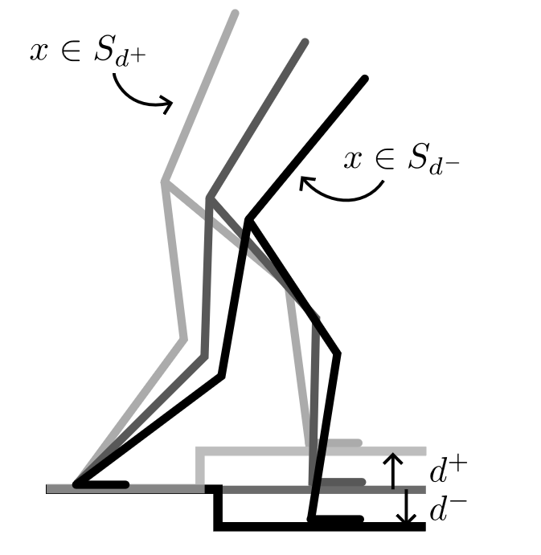
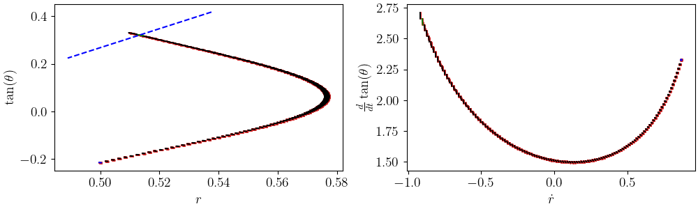
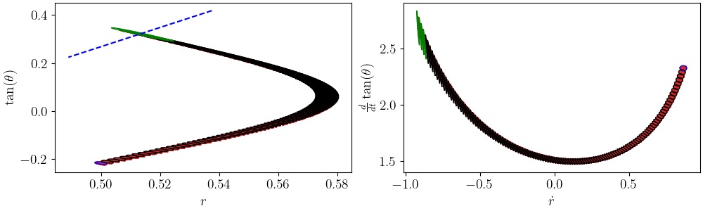

## Verification and Robust Control of Hybrid Systems
::: {.column width="50%"}
- View robust periodic walking as maximizing the size of a local invariant set
- Rapidly compute an approximation of the forward-invariant set using interval analysis
- Fully differentiable method lets us maximize the size of the invariant set by optimizing the feedback controller
:::
::: {.column width="5%"}
:::
::: {.column width="45%"}
{fig-align="center" width=50%}

{fig-align="center" width=100%}
{fig-align="center" width=100%}
:::